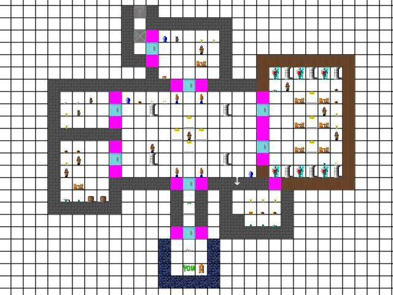
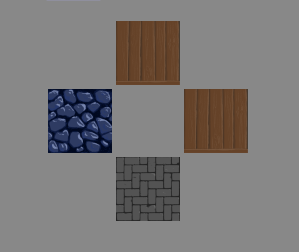
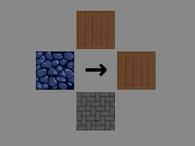

# Wolfenstein 3D w TypeScript

## Implementacja silnika klasycznego Wolfensteina oparta o pathtracing

Projekt nie wykorzystuje żadnych bibliotek czy frameworków do grafiki 3D. Całość działa na zwykłym Canvasie (context 2d). Implementując algorytm pathtracingu sugerowałem się [tym tutorialem dla języka C++](https://lodev.org/cgtutor/raycasting.html).

## Uruchomienie

Najprostszy sposób to wykorzystanie webpack dev server:

Zainstalowanie zależności:

`npm install`

Uruchomienie serwera:

`npm run serveprod`

Następnie należy przejść pod adres:

http://localhost:8080/game

## Sterowanie

Gracz porusza się strzałkami

`CTRL` - użycie broni

`Spacja` - interakcja (drzwi, sekrety)

`1 2 3 4` - wybór broni

Na początku gracz ma jedynie pistolet (`2`) oraz nóż (`1`).
Każda broń oprócz noża potrzebuje amunicji (jest ona wspólna dla wszystkich).

## Mapa demo

## Edytor poziomów\*

\* Strona ta jest bardziej przydatna do testowania, ponieważ sama gra nie wspiera wybierania poziomów. Aby zagrać w swój poziom należy zamienić ten domyślny i przebudować projekt.

Pod adresem http://localhost:8080/leveleditor znajduje się edytor poziomów. Na kratkowanym polu można umieszczać dowolne elementy wybrane z dostępnych powyżej (przytrzymując mysz można również rysować).

Przytrzymując `Shift` możemy wymazywać narysowane rzeczy.

Można również zmienić `szerokość planszy` i `wysokość planszy` wpisując rozmiar w polu tekstowym.

`Scroll` pozwala przybliżać i oddalać. `ŚPM` pozwala chwycić i przesunąć planszę.

Na każdym poziomie należy umieścić gracza (element oznaczony `YOU`)

Dostępni przeciwnicy to `żołnież` i `pies` (znajdują się obok elementu `YOU`)

Formalnie poziom kończy się, kiedy gracz dotknie ściany z przełącznikiem (ostatni dostępny element)

Pierwsze trzy elementy to różne rodzaje ścian. Dodatkowo po wybraniu ściany pojawia się podgląd każdej "ściany" tej ściany. Każdą z nich możemy do woli zmienić, klikając w nią.

Ściana może prowadzić do `sekretu`. Aby tak było, należy kliknąć pośrodku podglądu ścian, aby wybrać kierunek, w którym ściana ma się przesunąć po kliknięciu `spacji` na niej.

Aby zagrać w swój poziom należy zamienić ten domyślny `levels/1.json` i uruchomić ponownie (przebudować) projekt
